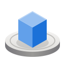
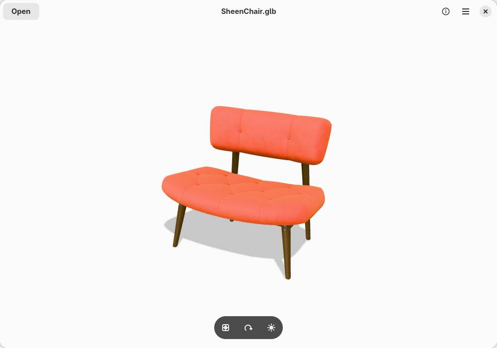
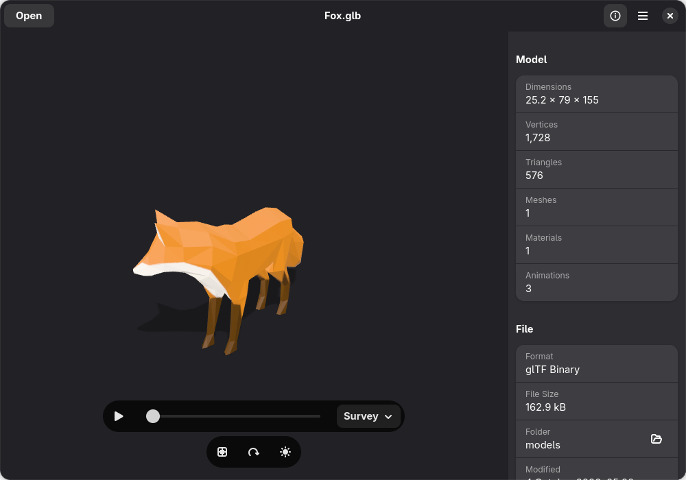
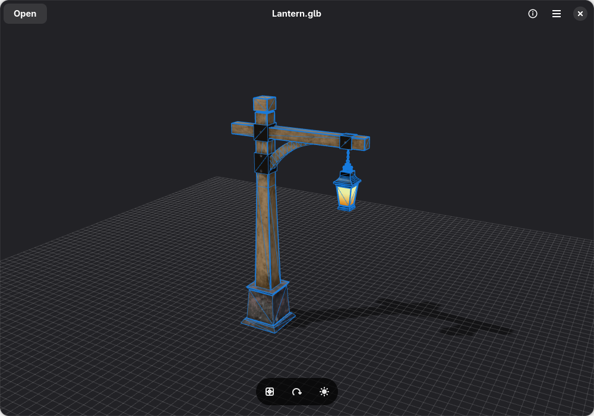

<div align="center">



# 3D Viewer

**Look at 3D models from every side.**

Open a model, turn it around, see it in good light. A simple, native 3D viewer for GNOME.



</div>

## What it does

- **Opens the common formats:** glTF, GLB, OBJ, STL, PLY, FBX and 3MF. Open one from Files,
  drag it into the window, or press **Open**.
- **Lights it nicely:** Studio, Soft, Sunlight or Dramatic lighting, with a soft shadow.
- **Shows how it's built:** switch to wireframe, or draw it over the shaded model, and add
  a floor grid.
- **Plays its animations:** play, pause, scrub, and pick between them.
- **Spins on its own,** slowly, like a turntable.
- **Tells you about it:** size, vertices, triangles, meshes, materials and file details.
- **Takes a picture:** copy or save exactly what you see, transparent background included.

It fits right in: light and dark styles, your accent colour, and windows down to phone size.

<table>
  <tr>
    <td></td>
    <td></td>
  </tr>
</table>

## Moving around

| To | Mouse or touchpad | Touchscreen | Keyboard |
|---|---|---|---|
| Turn | Drag | Drag with one finger | Arrow keys |
| Move | Right-drag | Drag with two fingers | |
| Zoom | Scroll | Pinch | <kbd>+</kbd> <kbd>−</kbd> |
| Start over | | | <kbd>Ctrl</kbd> <kbd>0</kbd> |
| Spin on its own | | | <kbd>R</kbd> |
| Play or pause | | | <kbd>Space</kbd> |
| Properties | | | <kbd>F9</kbd> |

<kbd>Ctrl</kbd> <kbd>?</kbd> shows every shortcut.

## Getting it

It isn't on Flathub yet. To build and install it yourself, you need GJS, GTK 4, libadwaita,
WebKitGTK 6.0 and Meson, which any recent GNOME desktop already has or can install:

```sh
git clone https://github.com/Jackicus/GNOME-Turntable.git
cd GNOME-Turntable
meson setup build --prefix=/usr
sudo meson install -C build
```

Then look for **3D Viewer** in your apps. Want to try it without installing? `scripts/run.sh`
builds and runs it from the source folder.

## For developers

GJS, GTK 4 and libadwaita for the window; [three.js](https://threejs.org) draws the model in a
WebKit view that can't reach the network or anything outside the model's own folder.
`scripts/check.sh` builds and tests it, and [CLAUDE.md](CLAUDE.md) explains the layout. The
codename **Turntable** is used for the app ID (`io.github.jackicus.Turntable`), the binary
and this repository.

## Credits

- [three.js](https://threejs.org), MIT licence
- Models in the screenshots, from the
  [Khronos glTF Sample Assets](https://github.com/KhronosGroup/glTF-Sample-Assets):
  *Sheen Chair* by Eric Chadwick (CC0); *Fox* by PixelMannen (CC0), rigged and animated by
  tomkranis (CC BY 4.0), converted to glTF by AsoboStudio and scurest (CC BY 4.0);
  *Lantern* by sbtron and Frank Galligan (CC0)

## Licence

GPL-2.0-or-later
